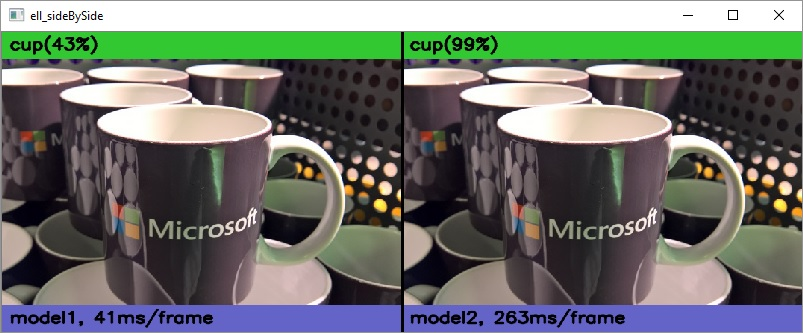

# Comparing image classification models side by side on the Raspberry Pi

In this tutorial, we will download two models from the [ELL gallery](/ELL/gallery/) and run them side-by-side on a Raspberry Pi. Some of the models on the gallery are slower abd accurate, while others are faster but less accurate. Running two models as once allows us to get a sense of their relative speeds and accuracies. Specifically, we will compare a standard (real valued) Convolutional Neural Network to a Neural Network that contains binarized layers. The binarized model is smaller and faster, but less accurate. 

---



#### Materials

* Laptop or desktop computer (Windows, Linux, or Mac)
* Raspberry Pi
* Raspberry Pi camera or USB webcam
* *optional* - Active cooling attachment (see our [tutorial on cooling your Pi](/ELL/tutorials/Active-cooling-your-Raspberry-Pi-3/))

#### Prerequisites

* Install ELL on your computer ([Windows](https://github.com/Microsoft/ELL/blob/master/INSTALL-Windows.md), [Ubuntu Linux](https://github.com/Microsoft/ELL/blob/master/INSTALL-Ubuntu.md), [Mac](https://github.com/Microsoft/ELL/blob/master/INSTALL-Mac.md)). Specifically, this tutorial requires ELL, CMake, SWIG, and Python 3.6. 
* Follow the instructions for [setting up your Raspberry Pi](/ELL/tutorials/Setting-up-your-Raspberry-Pi).
* Complete the basic tutorial, [Getting started with image classification on Raspberry Pi](/ELL/tutorials/Getting-started-with-image-classification-on-the-Raspberry-Pi/), to learn how to produce a Python wrapper for an ELL model.

## Step 1: Activate your environment and create a tutorial directory

If you followed the setup instructions, you should have an environment named `py36`. Open a terminal window and activate your anaconda environment.  

```
[Unix] source activate py36
[Windows] activate py36 
```

Then, cd into the directory where you built ELL and create a `sideBySide` directory

```
cd ELL/build
mkdir sideBySide
cd sideBySide
```

## Step 2: Download two pre-trained models

Download this [real-valued ELL model](https://github.com/Microsoft/ELL-models/raw/master/models/ILSVRC2012/d_I160x160x3CMCMCMCMCMCMC1A/d_I160x160x3CMCMCMCMCMCMC1A.ell.zip) and this [binarized ELL model](https://github.com/Microsoft/ELL-models/raw/master/models/ILSVRC2012/d_I160x160x3NCMNCMNBMNBMNBMNBMNC1A/d_I160x160x3NCMNCMNBMNBMNBMNBMNC1A.ell.zip)
into the `sideBySide` directory.

```
curl --location -o model1.ell.zip https://github.com/Microsoft/ELL-models/raw/master/models/ILSVRC2012/d_I160x160x3CMCMCMCMCMCMC1A/d_I160x160x3CMCMCMCMCMCMC1A.ell.zip
curl --location -o model2.ell.zip https://github.com/Microsoft/ELL-models/raw/master/models/ILSVRC2012/d_I160x160x3NCMNCMNBMNBMNBMNBMNC1A/d_I160x160x3NCMNCMNBMNBMNBMNBMNC1A.ell.zip
```

Unzip the compressed files.

```
unzip model1.ell.zip
unzip model2.ell.zip
```

Rename them to `model1.ell` and `model2.ell` respectively.

```
[Unix] mv d_I160x160x3CMCMCMCMCMCMC1A.ell model1.ell && mv d_I160x160x3NCMNCMNBMNBMNBMNBMNC1A.ell model2.ell
[Windows] ren d_I160x160x3CMCMCMCMCMCMC1A.ell model1.ell && ren d_I160x160x3NCMNCMNBMNBMNBMNBMNC1A.ell model2.ell
```

(One Windows, unzip is part of the Git distribution, for example, in `\Program Files\Git\usr\bin`.)
Next, download the file of [category names](https://github.com/Microsoft/ELL-models/raw/master/models/ILSVRC2012/categories.txt) that correspond to these models.

```
curl --location -o categories.txt https://github.com/Microsoft/ELL-models/raw/master/models/ILSVRC2012/categories.txt
```

There should now be `model1.ell` and `model2.ell` files as well as a `categories.txt` file in the `sideBySide` directory.

## Step 3: Wrap the models in Python callable modules

Use the `wrap.py` tool to compile the models and create Python wrappers. We'll use the `--outdir` option to put the models into different directories.

````
python ../../tools/wrap/wrap.py categories.txt model1.ell -lang python -target pi3 -outdir model1
python ../../tools/wrap/wrap.py categories.txt model2.ell -lang python -target pi3 -outdir model2
````
You should see output similar to the following:

````
compiling model...
generating python interfaces for model1 in model1
running opt...
running llc...
success, now you can build the 'model1' folder
...
compiling model...
generating python interfaces for model2 in model2
running opt...
running llc...
success, now you can build the 'model2' folder
````

We also want to copy some additional python code to your Raspberry Pi for the purpose of running this tutorial.

```
[Unix] cp ../../../docs/tutorials/shared/tutorialHelpers.py pi3
[Windows] copy ..\..\..\docs\tutorials\shared\tutorialHelpers.py pi3
```

You should now have a `sideBySide` folder containing `model1` and `model2` directories as well as some helpful python utilities which we'll use later in this tutorial.

We are ready to move to the Raspberry Pi. You can copy the `sideBySide` folder to the Pi using the Unix `scp` tool or the Windows [WinSCP](https://winscp.net/eng/index.php) tool.

## Step 4: Call your models from a Python script

We will write a Python script that grabs images from the camera, invokes the models one at a time, and displays the two frames side-by-side. If you just want the full script, copy it from [here](/ELL/tutorials/Comparing-Image-Classification-models-side-by-side-on-the-Raspberry-Pi/sideBySide.py). Otherwise, create an empty text file named `sideBySide.py` and copy in the code snippets below. 

First, import a few dependencies, including system utilities, opencv, and numpy.
```python
import sys
import os
import time
import numpy as np
import cv2
import tutorialHelpers as helpers
```

Next, we need to import the models. Since they are contained in different directories, add the relative paths so Python can find them:

```python
sys.path.append("model1")
sys.path.append("model1/build/Release")
sys.path.append("model2")
sys.path.append("model2/build/Release")
import model1
import model2
```

The following functions help us get an image from the camera and read in the categories file.

```python
def get_image_from_camera(camera):
    if camera is not None:
        ret, frame = camera.read()
        if (not ret):
            raise Exception('your capture device is not returning images')
        return frame
    return None

# Return an array of strings corresponding to the model's recognized categories or classes.
# The order of the strings in this file are expected to match the order of the
# model's output predictions.
def get_categories_from_file(fileName):
    labels = []
    with open(fileName) as f:
        labels = f.read().splitlines()
    return labels
```

Define the main entry point and use the camera as an image source.

```python
def main(args):
    camera = cv2.VideoCapture(0)
```

Use the function we defined above to read the category names from the file provided on the command line.  

```python
    categories = get_categories_from_file("categories.txt")
```

Define an array to hold the models.

```python
    models = [model1, model2]    
```

The models expect input in a certain shape. For each model, get this shape and store it for use later on. 

```python    
    inputShapes = []
    inputShapes.append(models[0].get_default_input_shape())
    inputShapes.append(models[1].get_default_input_shape())
```

Allocate arrays to store each model's output. 

```python
    predictionArrays = []
    outputShape = models[0].get_default_output_shape()
    predictionArrays.append(models[0].FloatVector(outputShape.Size()))
    outputShape = models[1].get_default_output_shape()
    predictionArrays.append(models[1].FloatVector(outputShape.Size()))
```

Create a tiled image that will be used to display the two frames side-by-side. This function is provided by the helper module that we imported earlier.

```python
    tiledImage = helpers.TiledImage(len(models))
```

Next, set up a loop that keeps going until OpenCV indicates it is done, which is when the user hits any key. At the start of every loop iteration, read an image from the camera.

```python
    while (cv2.waitKey(1) == 0xFF):
        image = get_image_from_camera(camera)
```

Iterate over the models. In this case, we'll randomize the order so that, on average, no model has an advantage over another due to caching and so on.

```python
        modelIndexes = np.arange(len(models))
        np.random.shuffle(modelIndexes)

        for modelIndex in modelIndexes:
            model = models[modelIndex]
```

For each model, prepare the image as input to the model's predict function.

```python
            input = helpers.prepare_image_for_model(image, inputShapes[modelIndex].columns, inputShapes[modelIndex].rows)
```

With the processed image input handy, call the `predict` method to invoke the model. 

```python
            model.predict(input, predictionArrays[modelIndex])
```

As before, the `predict` method fills the `predictionsArray[modelIndex]` array with the model output. Each element of this array corresponds to one of the 1000 image classes recognized by the model. Extract the top 5 predicted categories by calling the helper function `get_top_n_predictions`.

```python
            top5 = helpers.get_top_n_predictions(predictionArrays[modelIndex], 5)
```

`top5` is an array of tuples, where the first element is the category index and the second element is the probability of that category. Match the category indices in `top5` with the category names in `categories`.

```python
            headerText = "".join(["(" + str(int(element[1]*100)) + "%) " + categories[element[0]] + "  " for element in top5])
```

Use the `draw_header` helper function to write the predicted category on the image. Since each model will write its own result, we make a copy of the input image.

```python
            modelFrame = np.copy(image)
            helpers.draw_header(modelFrame, headerText)
```

The model has now produced a frame which has the input image and the model's prediction results. Set this as one of the tiles in the tiledImage and show the result.

```python
            tiledImage.set_image_at(modelIndex, modelFrame)
            tiledImage.show()
```

Finally, write the code that invokes the `main` function and runs your script.

```python
if __name__ == "__main__":
    args = sys.argv
    args.pop(0) # when an args list is passed to parse_args, the first argument (program name) needs to be dropped
    main(sys.argv)
```

We are ready to move to the Raspberry Pi. You can copy the `sideBySide` folder to the Pi using the Unix `scp` tool or the Windows [WinSCP](https://winscp.net/eng/index.php) tool.

## Step 5: Build the Python wrappers on the Raspberry Pi

Log into your Raspberry Pi, either remotely using SSH or directly if you have a keyboard and screen connected. Find the `sideBySide` folder you just copied over and build the two CMake projects.

```
cd model1
mkdir build
cd build
cmake ..
make
cd ../..
cd model2
mkdir build
cd build
cmake ..
make
cd ../..
```

## Step 8: Classify live video on the Raspberry Pi

If you followed the [Raspberry Pi Setup Instructions](/ELL/tutorials/Setting-up-your-Raspberry-Pi), you should have an anaconda environment named `py34`. Activate it and run the script that we wrote above. 

```
source activate py34
python sideBySide.py
```

If you have a camera and display connected to your Pi, you should see a window similar to the screenshot at the top of this page. Point your camera at different objects and see how the model classifies them. If you downloaded the full source for [sideBySide.py](/ELL/tutorials/Comparing-Image-Classification-models-side-by-side-on-the-Raspberry-Pi/sideBySide.py), you will also see the average time in milliseconds it takes each model to process a frame. Try to get a sense of the relative accuracy and speed of each model. 

## Troubleshooting

If you run into trouble, you can find some troubleshooting instructions at the bottom of the [Raspberry Pi Setup Instructions](/ELL/tutorials/Setting-up-your-Raspberry-Pi).