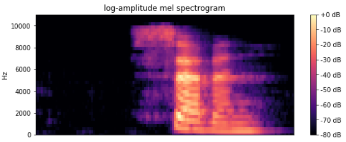

# Getting started with audio keyword spotting on the Raspberry Pi

*by Chris Lovett*

This tutorial guides you through the process of getting started with audio keyword spotting on your Raspberry Pi device. Unlike previous tutorials in this series, which used a single ELL model, this one uses a featurizer model and a classifier model working together. The featurizer model is a [mel-frequency cepstrum](https://en.wikipedia.org/wiki/Mel-frequency_cepstrum) (mfcc) audio transformer, which preprocesses audio input, preparing it for use by the classifier model.
Think of it as a way of transforming the audio into a picture that the classifier can recognize.




*Figure 1. Mel spectrogram of the word 'seven'*

---

## Before you begin

Complete the following steps before starting the tutorial.
* Install ELL on your computer ([Windows](https://github.com/Microsoft/ELL/blob/master/INSTALL-Windows.md), [Ubuntu Linux](https://github.com/Microsoft/ELL/blob/master/INSTALL-Ubuntu.md), [macOS](https://github.com/Microsoft/ELL/blob/master/INSTALL-Mac.md)).
* Follow the instructions for [setting up your Raspberry Pi](/ELL/tutorials/Raspberry-Pi-setup).

## What you will need

* Laptop or desktop computer
* Raspberry Pi 3
* USB microphone

## Overview

The audio file [seven.wav](seven.wav) shown in Figure 1 is a mel spectrogram, generated by a mel-frequency cepstrum audio transformer.
The horizontal bands correspond to the different frequencies of vocal chords.
This frequency map is something that a neural network can learn to recognize through the use of a classifier model.
The classifier model file contains a deep neural network trained for keyword spotting on a [Kaggle audio dataset](https://www.kaggle.com/c/tensorflow-speech-recognition-challenge/data), which consists of
60,000 recordings of 30 different keywords. (Keywords that the classifier should recognize are in the **categories.txt** file and include the following: bed, bird, cat, dog, down, eight, five, four, go, happy, house, left, marvin, nine, no, off, on, one, right, seven, sheila, six, stop, three, tree, two, up, wow, yes, zero.)

In this tutorial, you'll download a pretrained keyword spotting model from the [Embedded Learning Library (ELL) audio gallery](/ELL/gallery/speech_commands_v0.01/) to a laptop or desktop computer.
You'll compile the model and wrap it in a Python module.
Finally, you'll write a simple Python script that captures audio from the Raspberry Pi's microphone and then attempts to detect the keywords spoken.


## Activate your environment and create a tutorial directory

After following the setup instructions, you'll have an Anaconda environment named **py36** on your laptop or desktop computer.
On your computer, open a terminal window and activate your Anaconda environment.


```shell
[Linux/macOS] source activate py36
[Windows] activate py36
```
Create a directory for this tutorial anywhere on your computer and `cd` into it.

## Download the featurizer model and the classifier model
On your laptop or desktop computer, download this [ELL featurizer model file](https://github.com/Microsoft/ELL-models/raw/master/models/speech_commands_v0.01/BluePaloVerde/featurizer.ell.zip) and this [ELL classifier model file](https://github.com/Microsoft/ELL-models/raw/master/models/speech_commands_v0.01/BluePaloVerde/GRU110KeywordSpotter.ell.zip) into your new tutorial directory.


Save the files locally as **featurizer.ell.zip** and **GRU110KeywordSpotter.ell.zip**.
The 16k suffix is to remind us that these models expect 16 kHz audio input:

```shell
curl --location -O https://github.com/Microsoft/ELL-models/raw/master/models/speech_commands_v0.01/BluePaloVerde/featurizer.ell.zip

curl --location -O https://github.com/Microsoft/ELL-models/raw/master/models/speech_commands_v0.01/BluePaloVerde/GRU110KeywordSpotter.ell.zip
```

Unzip the compressed files and rename them to the shorter names:

**Note** On Windows computers, the unzip utility is distributed as part of Git. For example, in `\Program Files\Git\usr\bin`.
On Linux computers, you can install unzip using the **apt-get install unzip** command.

```shell
unzip featurizer.ell.zip
unzip GRU110KeywordSpotter.ell.zip
[Linux/macOS] mv GRU110KeywordSpotter.ell classifier.ell
[Windows] ren GRU110KeywordSpotter.ell classifier.ell
```

Next, download the **categories.txt** file from [here](https://github.com/Microsoft/ELL-models/raw/master/models/speech_commands_v0.01/categories.txt) and save it in the directory.

```shell
curl --location -o categories.txt https://github.com/Microsoft/ELL-models/raw/master/models/speech_commands_v0.01/categories.txt
```

This file contains the names of the 30 keywords that the model is trained to recognize and one category reserved for background noise.
For example, if the model recognizes category 11, you can read line 11 of the categories.txt file to find out that it recognized the word "happy."

There should now be a **featurizer.ell** file and a **classifier.ell** file in your directory.

## Compile and run the model on your laptop or desktop computer

Before deploying the model to the Raspberry Pi device, practice deploying it to your laptop or desktop computer.
Deploying an ELL model requires two steps. First, you'll run the **wrap** tool, which both compiles the `featurizer.ell` and `classifier.ell` models into machine code and generates a CMake project to build a Python wrapper for it.
Second, you'll call **CMake** to build the Python library.

Run **wrap** as follows, replacing `<ELL-root>` with the path to the ELL root directory (the directory where you cloned the ELL repository).

```shell
python <ELL-root>/tools/wrap/wrap.py --model_file featurizer.ell --target host --outdir compiled_featurizer --module_name mfcc
python <ELL-root>/tools/wrap/wrap.py --model_file classifier.ell --target host --outdir compiled_classifier --module_name model
```

Here, you used the command line option of `--target host`, which tells **wrap** to generate machine code for execution on the laptop or desktop computer, rather than machine code for the Raspberry Pi device.
This results in the following output.

```
compiling model...
generating python interfaces for featurizer in featurizer
running opt...
running llc...
success, now you can build the 'featurizer' folder
```
Similar output results for the classifier model.
The **wrap** tool creates a CMake project, so you should have two new directories, named **compiled_featurizer** and **compiled_classifier**.
You can now build these using a build script:

```shell
mkdir build
cd build
[Linux/macOS] cmake .. -DCMAKE_BUILD_TYPE=Release && make && cd ../..
[Windows] cmake -G "Visual Studio 16 2019" -A x64 .. && cmake --build . --config Release && cd ..\..
```

Run this script on both the compiled_featurizer and compiled_classifier folders.

Now, you are almost ready to use these compiled models. Before you do, copy over some Python helper code.
This code uses the **pyaudio** library to read .wav files or to read input from your microphone by converting the raw PCM data
into the correct scale of floating point numbers needed for the featurizer model input.

```
[Linux/macOS] cp <ELL-root>/tools/utilities/pythonlibs/audio/*.py .
[Windows] copy <ELL-root>\tools\utilities\pythonlibs\audio\*.py .
```

## Invoke the model on your computer

The next step is to create a Python script that
1. Loads the compiled models
2. Sends audio to the featurizer model
3. Send the featurizer model output to the classifier model
4. Interprets the classifier model's output.
(View the full script [here](https://github.com/Microsoft/ELL/raw/master/tools/utilities/pythonlibs/audio/run_classifier.py).)

Now, one of the audio scripts you just copied is named `run_classifier.py` and so you will use
that here.  The inner loop inside that script is transforming the audio using the featurizer
and then calling predict as follows:

```python
while True:
    feature_data = transform.read()
    if feature_data is None:
        break
    else:
        prediction, probability, label = predictor.predict(feature_data)
        if probability is not None:
            percent = int(100 * probability)
            print("<<< DETECTED ({}) {}% {} >>>".format(prediction, percent, label))
```

So try it out using the `seven.wav` file included with this tutorial.  Make a directory named `audio` and copy the `seven.wav` file into it.
Then run the following:

```shell
python run_classifier.py --featurizer compiled_featurizer/mfcc --classifier compiled_classifier/model --categories categories.txt --wav_file audio --sample_rate 16000 --auto_scale
```

Output similar to this will be displayed:

```
<<< DETECTED (20) 99% 'seven' >>>
<<< DETECTED (20) 99% 'seven' >>>
<<< DETECTED (20) 99% 'seven' >>>
<<< DETECTED (20) 99% 'seven' >>>
<<< DETECTED (20) 99% 'seven' >>>
<<< DETECTED (20) 99% 'seven' >>>
<<< DETECTED (20) 99% 'seven' >>>
<<< DETECTED (20) 99% 'seven' >>>
Average processing time: 0.00040631294250488277
```

As the audio is streaming to the classifier, it begins to detect the word.
When it passes the confidence threshold of 0.6, it starts printing the results, and you can see that as the word completes the classifier gets more confident, climbing to 99% confidence in this example.
The confidence will then drop off as the audio ends because the classifier runs past the end of the word.
The average processing time shows how long the feature and classifier models took to execute each frame of audio input in seconds,
so the time shown here is half a millisecond, which is not bad, it means these models will be able to easily keep up with real-time audio input.

### More about configuration
Use the following tips and information to adjust noise levels, use a USB microphone, and test models.
* **Modulating output.** To experiment with the configuration, set the threshold and smoothing value to zero and see all the output from the classifier.
This will make the classifier output more noisy, which is why some smoothing of the output is recommended.

* **USB microphone.** If you have a USB microphone attached to your computer, try running `run_classifier.py` with no wav_file and it will process your voice input.
When you use a microphone you will need to make sure the gain is high.  Test your microphone using your favorite voice recorder app, and if
the audio recording is nice and loud then it should work well.
The classifier was trained on auto-gain leveled input, so if your microphone is too quiet the classifier will not work.
Because the microphone input is an infinite stream you will also see a much longer "tail" on the classifier output as it drops back to 60% during the "silence" period between your spoken keywords.  Type 'x' to terminate the script.

* **Testing models.** Play with the `view_audio.py` to see a simple [GUI](https://en.wikipedia.org/wiki/Graphical_user_interface) app for testing the models.
It has the same command line arguments as `run_classifier.py` and a few more, like `--threshold 0.5` and `--ignore_label 0` and don't forget `--auto_scale`. This app also shows you what your mel spectrograms look like.

## Compile the model for execution on the Raspberry Pi device

All the same steps you completed, above, will work on your Raspberry Pi 3 device.
The only difference is you call **wrap** with the command line argument `--target pi3`.
In preparation for this, delete these folders so that the **wrap** tool can create new folders with Pi 3 code in them.

```shell
rm -rf compiled_featurizer
rm -rf compiled_classifier
```

Then run this:

```shell
python <ELL-root>/tools/wrap/wrap.py --model_file featurizer.ell --target pi3 --outdir compiled_compiled_featurizer --module_name mfcc
python <ELL-root>/tools/wrap/wrap.py --model_file classifier.ell --target pi3 --outdir compiled_compiled_classifier --module_name model
```

You are ready to move to the Raspberry Pi.
If your Pi is accessible over the network, copy the directory using the Unix `scp` tool or the Windows [WinSCP](https://winscp.net/eng/index.php) tool.

After you copy the entire tutorial folder over to your Raspberry Pi, continue with the build steps you did earlier, only on the Pi this time. Specifically, build the **compiled_featurizer** and **compiled_classifier** projects.

Install pyaudio components:

```shell
sudo apt-get install python-pyaudio
pip install pyaudio
```

Now you can run the **run_classifier.py** script on the Pi with the same command line arguments you used earlier and see how it does.
On the Pi you will see an average processing time of about 2.3 milliseconds, which means real-time audio processing is possible here too.

## Next steps

The [ELL gallery](/ELL/gallery/) offers different models for keyword spotting. Some are slow and accurate, while others are faster and less accurate. Different models can even lead to different power draw on the Raspberry Pi. Repeat the steps above with different models.

This tutorial used the **wrap** tool as a convenient way to compile the model and prepare for building its Python wrapper. To learn more, read the [wrap documentation](https://github.com/Microsoft/ELL/blob/master/tools/wrap/README.md).

## Troubleshooting

If you are not getting any results from run_classifier.py or view_audio.py then check the `sample_rate` information in `train_results.json` file from the model gallery.  If you see a sample rate of 8000 then you need to pass this information to run_classifier.py as the command line argument: `--sample_rate 8000`.  Similarly, check if 'auto_scale' was set to `true`, and if so pass `--auto_scale` to the python script.

Look for troubleshooting tips at the end of the [Raspberry Pi Setup Instructions](/ELL/tutorials/Raspberry-Pi-setup).