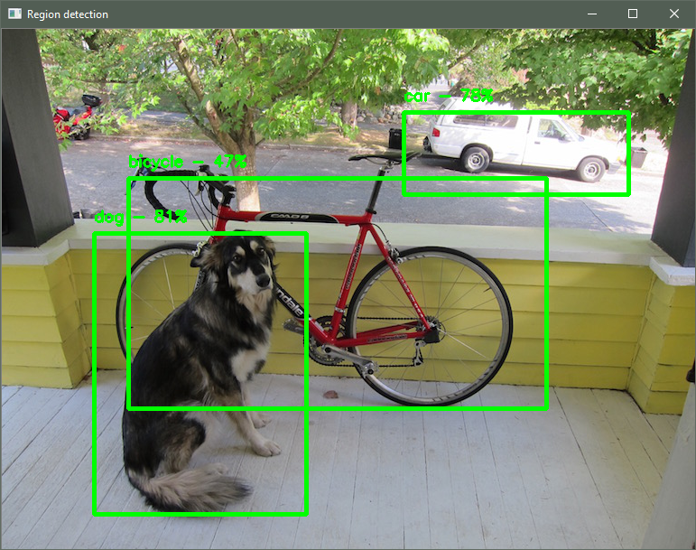

# Getting started with object detection using region of interest networks

*by Kern Handa*

Unlike standard image classification, which only detects the presence of an
object, object detection (using regions of interest) models can detect multiple
instances of different types of objects in the same image and provide
coordinates in the image where these objects are located. The pretrained model
used here has been trained to detect 20 different objects and return their
positions.

This tutorial shows you how to use a trained Darknet model to detect objects,
classify them, and provide a bounding box for the object. The model used in
this tutorial can classify 20 different types of objects, such as cats, dogs,
cars, and so on. You'll learn how to write a script that can be used to detect
objects in images read from the camera and draw the corresponding bounding
boxes and labels.

#### Before you begin

* Install ELL on your computer
    ([Windows](https://github.com/Microsoft/ELL/blob/master/INSTALL-Windows.md),
    [Ubuntu Linux](https://github.com/Microsoft/ELL/blob/master/INSTALL-Ubuntu.md),
    [macOS](https://github.com/Microsoft/ELL/blob/master/INSTALL-Mac.md)).
* Follow the instructions for
[setting up your Raspberry Pi](/ELL/tutorials/Raspberry-Pi-setup).
* Complete the basic tutorial,
[Getting started with image classification on Raspberry Pi](/ELL/tutorials/Getting-started-with-image-classification-on-the-Raspberry-Pi/),
to learn how to produce a Python wrapper for an ELL model.

---



#### What you will need

* Laptop or desktop computer
* Raspberry Pi 3 device
* Raspberry Pi camera or USB webcam
* Optional: Active cooling attachment (see our [tutorial on cooling your Pi](/ELL/tutorials/Active-cooling-your-Raspberry-Pi-3/))

## Deploy a pretrained model on the Raspberry Pi device

The process for deploying a pretrained model on Raspberry Pi device is simillar
to instructions you might have followed in the Darknet model section of the
[importing models](/ELL/tutorials/Importing-models/) tutorial. Start by
downloading the model description, weights, and labels.

```shell
curl --location -o model.cfg https://raw.githubusercontent.com/pjreddie/darknet/master/cfg/yolov2-tiny-voc.cfg
curl --location -o model.weights https://pjreddie.com/media/files/yolov2-tiny-voc.weights
curl --location -o categories.txt https://raw.githubusercontent.com/pjreddie/darknet/master/data/voc.names
```

Next, import the Darknet model into ELL by running `darknet_import.py`, replacing `<ELL-root>` with the path to the ELL root directory (the directory where you cloned the ELL repository).

```shell
python <ELL-root>/tools/importers/darknet/darknet_import.py model.cfg model.weights
```

Output similar to the following will be displayed.

```shell
Convolution :  416x416x3  ->  416x416x16 | input padding 1  output padding 0
MaxPooling :  416x416x16  ->  208x208x16 | input padding 0  output padding 1
Convolution :  208x208x16  ->  208x208x32 | input padding 1  output padding 0
MaxPooling :  208x208x32  ->  104x104x32 | input padding 0  output padding 1
Convolution :  104x104x32  ->  104x104x64 | input padding 1  output padding 0
MaxPooling :  104x104x64  ->  52x52x64 | input padding 0  output padding 1
Convolution :  52x52x64  ->  52x52x128 | input padding 1  output padding 0
MaxPooling :  52x52x128  ->  26x26x128 | input padding 0  output padding 1
Convolution :  26x26x128  ->  26x26x256 | input padding 1  output padding 0
MaxPooling :  26x26x256  ->  13x13x256 | input padding 0  output padding 1
Convolution :  13x13x256  ->  13x13x512 | input padding 1  output padding 0
MaxPooling :  13x13x512  ->  13x13x512 | input padding 0  output padding 1
Convolution :  13x13x512  ->  13x13x1024 | input padding 1  output padding 1
Convolution :  13x13x1024  ->  13x13x1024 | input padding 1  output padding 0
Convolution :  13x13x1024  ->  13x13x125 | input padding 0  output padding 0
RegionDetection :  13x13x125  ->  13x13x125 | input padding 0  output padding 0
Saving model file: 'model.ell'
```

Compile the imported ELL model by running `wrap.py` for the Raspberry Pi device
target.

```shell
python <ELL-root>/tools/wrap/wrap.py model.ell --lang python --target pi3
```

Copy the resulting CMake project to the Raspberry Pi device, and build it
there, as shown in [Getting started with image classification on the Raspberry Pi](/ELL/tutorials/Getting-started-with-image-classification-on-the-Raspberry-Pi/).
After completing these steps, you should have a Python module on your Pi named
`model`.

Also copy a few helper functions to the directory.

```shell
[Linux/macOS] cp <ELL-root>/docs/tutorials/shared/tutorial_helpers.py .
[Windows] copy <ELL-root>\docs\tutorials\shared\tutorial_helpers.py .
```

We are ready to move to the Raspberry Pi. If your Pi is accessible over the
network, you can copy the directory using the Unix `scp` tool or the Windows
[WinSCP](https://winscp.net/eng/index.php) tool.

## Write code to invoke the model on the Raspberry Pi device

Here you'll write a Python script that invokes the model on a Raspberry Pi
device, finds the regions describing the objects of interest in the image,
discards overlapping regions, and draws the final set of regions on the image.

If you just want the code, copy the complete script from
[here](/ELL/tutorials/Getting-started-with-region-detection/tutorial.py).
Otherwise, create an empty text file named `tutorial.py` and copy in the code
snippets below.

First, import the required modules.

```python
import cv2
import numpy as np
import tutorial_helpers as helpers
```

Also, import the Python module for the compiled ELL model.

```python
import model
```

Object detection models use anchor boxes. In the case of Darknet models, the
values for the anchor boxes can be found in the file that ends in `.cfg`, which
describes the network layout. Look for the `anchors` key under the `region`
heading, like this:

```
[region]
anchors = 1.08,1.19,  3.42,4.41,  6.63,11.38,  9.42,5.11,  16.62,10.52
```

Copy these values into the script as a global constant, so that it can be used
when running the model.

```python
ANCHOR_BOXES = [1.08,1.19,  3.42,4.41,  6.63,11.38,  9.42,5.11,  16.62,10.52]
```

Next, set two other constants. The first is a confidence threshold for the
object detection. This is the minimum confidence needed for a region to be
considered "valid" and drawn onto the final image. The second constant is
overlap threshold, which is minimum amount of overlap between two overlapping
bounding boxes before they are considered the same and consolidated into one
box. Both values are tuneable and should be adjusted according to the scenarios
in which they are being used.

```python
CONFIDENCE_THRESHOLD = 0.4
OVERLAP_THRESHOLD = 0.05
```

As in previous tutorials, define a helper function that reads images from the
camera.

```python
def get_image_from_camera(camera):
    if camera:
        ret, frame = camera.read()
        if not ret:
            raise Exception("your capture device is not returning images")
        return frame
    return None
```

Define the main entry point and use the camera as the image source.

```python
def main():
    camera = cv2.VideoCapture(0)
```

The argument **0** in the function call above selects the default camera. If you have more than one camera connected to your Pi device, choose which camera to use by changing this argument. Read the list of categories from `categories.txt`.

```python
    with open("categories.txt", "r") as categories_file:
        categories = categories_file.read().splitlines()
```

Get the model input shape, which you will use to prepare the input data.

```python
    input_shape = model.get_default_input_shape()
```

Get the model output shape, which you will use to do post-processing after
running the model.

```python
    output_shape = model.get_default_output_shape()
```

Next, set up a loop that keeps going until OpenCV indicates it is done, which
is when the user hits any key. At the start of each iteration, read an image
from the camera. To exit the loop and close the application, press the Escape
key.

```python
    while (cv2.waitKey(1) & 0xFF) != 27:
        original = get_image_from_camera(camera)
```

The preparation of the image involves resizing the image, reordering the image
channels, and returning the image data as a flat `numpy` array of floats so
that it can be provided as input to the model.

```python
        image, offset, scale = helpers.prepare_image_for_model(
            original, input_shape.columns, input_shape.rows, reorder_to_rgb=True,
            ravel=False)
```

Send the processed image to the model to get a `numpy` array of predictions.

```python
        predictions = model.predict(image)
```

Next, reshape the predictions so that it is no longer a flat array. The
predictions now are in a grid, where the channel dimmension for each row and
column index contains dimensions describing a bounding box, the confidence that
there's actually an object within the bounding box, and the probability of the
category describing the object.

```python
        predictions = np.reshape(
            predictions,
            (output_shape.rows, output_shape.columns, output_shape.channels))
```

The reshaped predictions can now be used to get a list of detected regions by
calling `helpers.get_regions`.

```python
        regions = helpers.get_regions(
            predictions, categories, CONFIDENCE_THRESHOLD, ANCHOR_BOXES)
```

Object detection models can sometimes lead to a number of regions being
detected for the same object, which can cause rapidly changing bounding boxes
to be rendered for the same object, especially those with probabilities close
to the `CONFIDENCE_THRESHOLD`. One way of dealing with this is by using the
[**non-maximum suppression**](https://www.coursera.org/learn/convolutional-neural-networks/lecture/dvrjH/non-max-suppression)
algorithm. Briefly, for each object detected, start with the bounding box
you're most confident about and compare that to every other bounding box for
that object. If they overlap sufficiently (in this case, this is controlled by
`OVERLAP_THRESHOLD`), you discard the lower confidence bounding box. This
leaves you with reasonably unique regions for all the objects in the image.

To use this algorithm, call `helpers.non_max_suppression`.

```python
        regions = helpers.non_max_suppression(
            regions, OVERLAP_THRESHOLD, categories)
```

Finally, display the detected regions onto the original image.

```python
        scale = (scale[0] * image.shape[1], scale[1] * image.shape[0])
        helpers.draw_regions_on_image(original, regions, offset, scale)

        cv2.imshow("Object detection", original)

if __name__ == "__main__":
    main()
```

## Detect and classify objects in live video on the Raspberry Pi device

If you set up your device using the [Raspberry Pi Setup Instructions](/ELL/tutorials/Raspberry-Pi-setup), you should have an Anaconda environment named `py34`. Activate this environment and run the script.

```shell
source activate py34
python tutorial.py
```

Point your camera at different objects and see how the model detects and
classifies them. Look at `categories.txt` to see which categories the model is
trained to recognize and try to show those objects to the model. For quick
experimentation, point the camera to your computer screen, have your computer
display images of different objects, and see the regions that are detected.

## Next steps

An improvement that you could make is to randomly generate a color for each
object type, and then use that color to the draw the region where that type of
object is detected.

You may also have noticed that drawn box around object moves slightly and
changes width or height. This is because of minor differences in lighting and
shadow that affect the output of the object detection network. One way to
address this issue is to add a post-processing step, where a filter like a
[Kalman filter](https://en.wikipedia.org/wiki/Kalman_filter) is applied to the
detected regions.

## Troubleshooting

For help with Raspberry Pi device set up, see
[Raspberry Pi Setup Instructions](/ELL/tutorials/Raspberry-Pi-setup).
