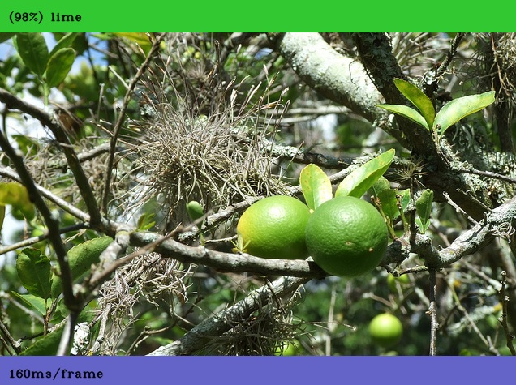
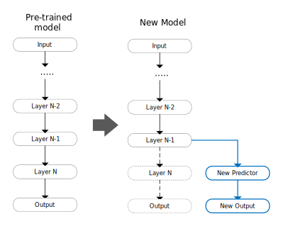

# Repurposing a pretrained image classifier

*by Byron Changuion*

This tutorial provides instructions on how to repurpose a pretrained image classifier to understand transfer learning. Repurposing or retargeting a pretrained neural network is one example of transfer learning. In the example used here, the original neural network was trained on the 1000 class ILSVRC2012 ImageNet dataset. By taking output from one of the layers near the output of the network, you can leverage (or transfer) the pretrained model's ability to recognize general features and use it as a featurizer to another predictor. This predictor only needs to learn how to map those features onto the new classes that you want it to recognize. Putting it all together results in a new model that has been repurposed from the original 1,000 classes to recognize a different set of classes.

In this tutorial, you will complete the following:
* Download a pretrained image classification model from the [ELL gallery](/ELL/gallery/) to a laptop or desktop computer
* Repurpose the model to predict a different set of specified classes.
* Compile the new model and wrap it in a Python module.
* Write a simple Python script that runs a validation dataset through the model and prints the results.

In addition to being very quick to train, the model in this tutorial is also much more accurate than the original, because it has been specialized with significantly fewer output classes.

---



## Before you begin
Complete the following steps before starting the tutorial.
* Install ELL on your computer ([Windows](https://github.com/Microsoft/ELL/blob/master/INSTALL-Windows.md), [Ubuntu Linux](https://github.com/Microsoft/ELL/blob/master/INSTALL-Ubuntu.md), [macOS](https://github.com/Microsoft/ELL/blob/master/INSTALL-Mac.md)).
* Optional: If you want to run this on a Raspberry Pi, follow the instructions for [setting up your Raspberry Pi](/ELL/tutorials/Raspberry-Pi-setup).

## What you will need

* Laptop or desktop computer

Optional items include the following:
* Raspberry Pi 3
* Active cooling attachment (refer to our [tutorial on cooling your Pi](/ELL/tutorials/Active-cooling-your-Raspberry-Pi-3/))

## Activate your environment and create a tutorial directory

After following the setup instructions, you  have an Anaconda environment named **py36**. Open a terminal window and activate your Anaconda environment.

```shell
[Linux/macOS] source activate py36
[Windows] activate py36
```

Create a directory for this tutorial anywhere on your computer and `cd` into it.

## Download pretrained model

Download this [compressed ELL model file](https://github.com/Microsoft/ELL-models/raw/master/models/ILSVRC2012/dsf_I64x64x3CCMCCMCCMCMCMC1AS/dsf_I64x64x3CCMCCMCCMCMCMC1AS.ell.zip) into the directory. The model file contains a pretrained Deep Neural Network for image classification and is one of the models available from the [ELL gallery](/ELL/gallery). Save it locally as `pretrained.ell.zip`. This is a small, fast model that is not very accurate on the 1000 class ILSVRC2012 dataset (Top-1 accuracy of 44.67%). However, it is adequate when you use the `retargetTrainer` to leverage this pretrained model to create a specialized model that can classify a smaller set of your own classes.

```shell
curl --location -o pretrained.ell.zip https://github.com/Microsoft/ELL-models/raw/master/models/ILSVRC2012/dsf_I64x64x3CCMCCMCCMCMCMC1AS/dsf_I64x64x3CCMCCMCCMCMCMC1AS.ell.zip
```

Now, unzip the compressed file.

**Note** On Windows, the `unzip` utility is distributed as part of Git. For example, in `\Program Files\Git\usr\bin`. On Linux computers, you can install unzip using the **apt-get install unzip** command.

```shell
unzip pretrained.ell.zip
```

Rename the `dsf_I64x64x3CCMCCMCCMCMCMC1AS.ell` model file to `pretrained.ell`:

```shell
[Linux/macOS] mv dsf_I64x64x3CCMCCMCCMCMCMC1AS.ell pretrained.ell
[Windows] ren dsf_I64x64x3CCMCCMCCMCMCMC1AS.ell pretrained.ell
```

A `pretrained.ell` file now appears in the directory.

## Create your training datasets
Before you retarget an existing neural network, you must create a training dataset for the image classes you want to recognize. In this tutorial, you'll classify images of 10 common fruits, including `apple, banana, blackberry, blueberry, cherry, grapes, lemon, lime, orange and raspberry`.

Put images of each class in a separate folder under the class name, using a different set of images for training and validation. For example:
```
data
   +-----fruit
            +-----apple
                    ------ apple01.jpg
                    ------ apple02.jpg
                    .... etc ...
            +-----banana
            +-----blackberry
            +-----blueberry
            +-----cherry
            +-----grapes
            +-----lemon
            +-----lime
            +-----orange
            +-----raspberry
```
**Note** Make sure that you have the appropriate rights or licensing to use the images in your datasets. If you use a search engine like Bing or Google, filter on the license type that makes sense for your situation.

After you have the images in the appropriate folder structure, you are ready to use the [datasetsFromImages](https://github.com/Microsoft/ELL/blob/master/tools/utilities/datasetFromImages/README.md) Python tool to create our training and validation datasets with the `--folder` option. Make sure to replace `<ELL-root>` with the path to the ELL root directory (the directory where you cloned the ELL repository).  It might be handy to set an environment variable named ELL_root with this path.

```shell
python <ELL-root>/tools/utilities/datasetFromImages/datasetFromImages.py --imageSize 64x64 --outputDataset train.gsdf --folder data/fruit/train --extractValidation 0.1
```

This tells the `datasetsFromImages` tool to create a multiclass dataset by walking the folders. It uses each subdirectory as the class name and each image as an example of that class. The `--imageSize 64x64` switch tells the tool to center, crop, and scale images to 64x64, because that's what the pretrained model expects. The dataset is in ELL's generalized spare data format and is saved to `train.gsdf`.  The `--extractValidation` switch causes the tool to automatically allocate
10% of the images to a separate `validation.gsdf` dataset.

Output may look like this:
```
Wrote class category labels to categories.txt
Discovered 400 examples and 10 categories
Processing 80 examples, using image size 64x64, bgr=True
Wrote 80 examples to validation.gsdf
Extracted 'validation.gsdf' subset containing 28 examples
Processing 320 examples, using image size 64x64, bgr=True
Wrote 320 examples to train.gsdf
Total time to create dataset: 8.8 seconds
```

This indicates the tool found 280 images across 10 categories, which it then split into a `train.gsdf` dataset and a `validation.gsdf` dataset.  It also wrote the class names to `categories.txt`.

## Create a custom classifier from a pretrained one

Next, you'll use the `retargetTrainer` tool to direct the output of an ELL Node to be the input of a new predictor. The predictor is trained to correlate the output of the pretrained network at that ELL node to the new classes you want to classify, using your training set and ELL's Stochastic Dual Coordinate Ascent trainer. Conceptually, this uses most of the pretrained network as a featurizer for the new predictor. The tool connects the two pieces together to form a new model. A simplified diagram of what the looks like is shown in `Figure 1`.


*Figure 1: Retarget an existing model*

The `retargetTrainer` requires the output of the ELL node (or nodes) in order to to redirect from the pretrained model. It also needs the training dataset.

Use the `print` option to list the ELL nodes in the model:

```shell
[Linux/macOS] $ELL_root/build/bin/retargetTrainer --refineIterations 1 --inputModelFilename pretrained.ell --print
[Windows] %ELL_root%\build\bin\release\retargetTrainer --refineIterations 1 --inputModelFilename pretrained.ell --print
```

This will output all the nodes in the network after one refinement operation. This produces a lot of output, so instead we can "grep" just for those nodes involved in ReLUActivation and you will find the following nodes:

```
node_1340 (000002C554420D20) = BroadcastUnaryFunctionNode<float,ReLUActivationFunction<float>>(node_1339.output)
node_1356 (000002C554433450) = BroadcastUnaryFunctionNode<float,ReLUActivationFunction<float>>(node_1355.output)
node_1373 (000002C5544E5BB0) = BroadcastUnaryFunctionNode<float,ReLUActivationFunction<float>>(node_1372.output)
node_1389 (000002C55441DB70) = BroadcastUnaryFunctionNode<float,ReLUActivationFunction<float>>(node_1388.output)
node_1406 (000002C5545C5420) = BroadcastUnaryFunctionNode<float,ReLUActivationFunction<float>>(node_1405.output)
node_1422 (000002C554661B40) = BroadcastUnaryFunctionNode<float,ReLUActivationFunction<float>>(node_1421.output)
node_1439 (000002C55468A680) = BroadcastUnaryFunctionNode<float,ReLUActivationFunction<float>>(node_1438.output)
node_1456 (000002C5546A7E10) = BroadcastUnaryFunctionNode<float,ReLUActivationFunction<float>>(node_1455.output)
node_1464 (000002C5546B7D10) = BroadcastUnaryFunctionNode<float,ReLUActivationFunction<float>>(node_1463.output)
```

For this tutorial, you'll use output from the second to last ReLU activation node.  In our print above this is node `1456`, but you might see different node ids in your output.  Refer to the Troubleshooting section of this tutorial for more information about choosing the right ELL node (or nodes) for your specific case.

Run the `retargetTrainer`, taking output from the node id you have identified in the pretrained model, and produce a retargeted model using the `train.gsdf` dataset.  Notice below that the name of the output of node `1456` is simply specified as `1456.output`.

```shell
[Linux/macOS] $ELL_root/build/bin/retargetTrainer --maxEpochs 100 --multiClass true --refineIterations 1 --verbose --inputModelFilename pretrained.ell --targetPortElements 1456.output --inputDataFilename train.gsdf --outputModelFilename model.ell

[Windows] %ELL_root%\build\bin\release\retargetTrainer --maxEpochs 100 --multiClass true --refineIterations 1 --inputModelFilename pretrained.ell --targetPortElements 1456.output --inputDataFilename train.gsdf --outputModelFilename model.ell
```

Output similar to the following indicates how training for each of the new classes progressed.
```
Redirected output for port elements 1456.output from model

=== Training binary classifier for class 0 vs Rest ===
Training ...
Final duality Gap: 7.89037e-06

ErrorRate       Precision       Recall  F1-Score        AUC     MeanLoss
1.000000        0.000000        0.000000        0.000000        0.000000        0.693147
0.000000        1.000000        1.000000        1.000000        1.000000        0.001131

Training completed successfully.


...
...
...

=== Training binary classifier for class 9 vs Rest ===
Training ...
Final duality Gap: 0.000009

ErrorRate       Precision       Recall  F1-Score        AUC     MeanLoss
1.000000        0.000000        0.000000        0.000000        0.000000        0.693147
0.000000        1.000000        1.000000        1.000000        1.000000        0.001126

Training completed successfully.

New model saved as model.ell
```

You now have a `model.ell` file containing the retargeted model.

## Compile the model for execution on the host

Compiling an ELL model requires two steps. First,  run a tool named `wrap`, which both compiles `model.ell` into machine code and generates a CMake project to build a Python wrapper for it. Second, call CMake to build the Python library.

Run `wrap` as follows.

```shell
python <ELL-root>/tools/wrap/wrap.py --model_file model.ell --language python --target host
```

**Note** The `wrap` in this case includes the command line option *--target host*, which tells it to generate machine code for execution on the laptop or desktop computer, rather than machine code for the Raspberry Pi.

The following output appears.

```
compiling model...
generating python interfaces for model in host
running opt...
running llc...
success, now you can build the 'host' folder
```

The *wrap* tool creates a CMake project in a new directory named **host**. Create a **build** directory inside the **host** directory and change to that directory

```shell
cd host
mkdir build
cd build
```

To finish creating the Python wrapper, build the CMake project.

```shell
[Linux/macOS] cmake .. -DCMAKE_BUILD_TYPE=Release && make && cd ../..
[Windows] cmake -G "Visual Studio 16 2019" -A x64 .. && cmake --build . --config release && cd ..\..
```

You have just created a Python module named **model**.  This module provides functions that report the shapes of the model's input and output as well as the **predict** function, which invokes a compiled and optimized version of the retargeted model you created earlier.

Before writing the script that will use the compiled model, you also need to copy over some Python helper code.

```shell
[Linux/macOS] cp $ELL_root/docs/tutorials/shared/tutorial_helpers.py .
[Windows] copy %ELL_root%\docs\tutorials\shared\tutorial_helpers.py .
```

At this point, your **host** directory that contains a CMake project that builds the Python wrapper and some helpful Python utilities. In the next steps, you will use the following files created in the current directory:
* `categories.txt`
* `validate.gsdf`
* `tutorial_helpers.py`

## Write code to validate the model

Next, you'll write a Python script that loads the Python wrapper that was created previously, runs a validation dataset through the model, and outputs the results. If you just want the full script, copy it from [here](/ELL/tutorials/Repurposing-a-pretrained-image-classifier/retarget_validation.py). Otherwise, create an empty text file named **retarget_validation.py** and copy in the code snippets below.

First, import a few dependencies, including the helper that you copied over earlier.

```python
import time
import cv2
import sys
import os
import logging
import numpy as np
import tutorial_helpers as helpers
```

Import the helper code that you copied over.

**Note** The helper code helps find the compiled model files, so make sure to import it before importing the model.

```python
import tutorial_helpers as helpers
```

Import the Python wrapper for the compiled ELL model.

```python
import model
```

The main ELL Python module includes functionality that makes it easier to process the dataset. Rather than copying this module, use the `find_ell` helper function to find it.

```python
helpers.find_ell()
import ell
```

Create a function to save the results in the form of a `confusion matrix`. This is a good way to visualize the difference between what the model predicted and what the model was expected to predict. The predicted values are the rows and the expected values are the columns. The diagonal is where the predicted class and expected class are the same. You can read more about the confusion matrix presentation [here](https://en.wikipedia.org/wiki/Confusion_matrix).

```python
def save_confusion_matrix(categories, confusion_matrix_filename,
        confusion_matrix, num_correct, num_total,
        mean_time_to_predict = None):
    with open(confusion_matrix_filename, "w") as f:
        # Write the header
        f.write("\t")
        for category in categories:
            f.write("{}\t".format(category))
        f.write("\n")
        # Write the rows
        for i in range(confusion_matrix.shape[0]):
            f.write("{}\t".format(categories[i]))
            for value in confusion_matrix[i]:
                f.write("{}\t".format(int(value)))
            f.write("\n")
        f.write("\n")
        if mean_time_to_predict:
            f.write("Mean prediction time:\t\t\t {:.0f}ms/frame\n".format(
                mean_time_to_predict * 1000))
        f.write("Accuracy:\t\t\t {}/{} = {:.1f}%\n".format(num_correct, num_total, (num_correct / num_total) * 100))
```

Add code for the main function and define a few variables that hold filenames you're interested in.

```python
def main(args):

    categories_filename = 'categories.txt'
    validation_filename = 'validate.gsdf'
    confusion_matrix_filename = 'confusion_matrix.txt'
```

Next, read the category names from the `categories.txt` file.

```python
    with open(categories_filename, "r") as categories_file:
        categories = categories_file.read().splitlines()
```

Load the validation dataset.

```python
    dataset = ell.data.AutoSupervisedDataset()
    dataset.Load(validation_filename)
    num = dataset.NumExamples()
```

Create an array to hold the confusion matrix result and total number of correct predictions.

```python
    num_classes = len(categories)
    confusion_matrix = np.zeros((num_classes,num_classes),dtype=np.int32)
    num_correct = 0
```

Read each example into a numpy array.

```python
    for i in range(num):
        example = dataset.GetExample(i)
        auto_data_vector = example.GetData()

        data = np.asarray(auto_data_vector.ToArray()).astype(np.float_, copy=False)
```

Ask the model to predict the class based on the input data and pick the top result.

```python
        predictions = model.predict(data)
        predicted = np.argmax(predictions)
```

Get the expected result and add the values to the confusion matrix. If the predicted value matches the expected value, increase the number of correct predictions:

```python
        expected = int(example.GetLabel())
        confusion_matrix[predicted, expected] += 1
        if predicted == expected:
            num_correct += 1
```

After all examples have been processed, save the confusion matrix:
```python
    save_confusion_matrix(categories, confusion_matrix_filename, confusion_matrix, num_correct, num)
```

Call the main function when this script is run.

```python
if __name__ == "__main__":
    main(sys.argv[1:])
```

## Run the script

Run the Python script to test the retargeted model against the validation dataset.

```shell
python retarget_validation.py
```

The resulting `confusion_matrix.txt` file should look something like the following.

```
            apple       banana  blackberry  blueberry   cherry  grapes  lemon   lime    orange  raspberry
apple       9           0       0           0           0       0       0       1       0       0
banana      0           9       0           0           0       0       0       0       0       0
blackberry  0           0       9           1           0       1       0       0       0       0
blueberry   0           0       0           8           0       1       0       1       0       0
cherry      0           0       0           0           8       1       0       0       0       0
grapes      0           1       1           1           0       7       0       0       0       0
lemon       0           0       0           0           0       0       9       0       1       0
lime        1           0       0           0           0       0       0       8       0       0
orange      0           0       0           0           0       0       0       0       9       0
raspberry   0           0       0           0           2       0       1       0       0       10

Mean prediction time:   160ms/frame
Accuracy:               86/100 = 86.0%
```
## Results
The original pretrained model had a Top-1 accuracy of 44.67% against the 1000 class ILSVRC2012 dataset. Using the `retargetTrainer` to create a new model with the pretrained model as a featurizer, this new model has a Top-1 accuracy of 86% against this (much smaller) 10-class dataset.

Looking at the confusion matrix, you can also see where the model doesn't do well. For example, at the last row `raspberry`, you can see that the model predicted `raspberry` a total of 13 times (add up the numbers in the row), but there were only 10 instances of `raspberry` in the validation dataset (add up the numbers in the `raspberry` column). More specifically, notice that:
* In 2 instances, the model predicted raspberry, but the actual image was a cherry (row raspberry, column cherry)
* In 1 instance, the model predicted raspberry but the actual image was a lemon.

**Note**: The repurposed model will no longer be able to handle the 1000 classes the pretrained model.  It will get very confused if you show it a picture of a school bus or a dog.  It is now only useful in classifying the 10 fruits you have trained it on.  This is the price you pay for greatly increased accuracy.

## Next steps

Choosing the right ELL node to use for retargeting depends on the pretrained model and your new target domain. For example, in models that are highly specialized and don't relate well to your domain,  you'll probably get better results by picking ELL nodes nearer the input, where the features are more general and less correlated to the pretrained domain. Alternatively, models that are more general  (or where the original and target domains are similar) may benefit from retargeting ELL nodes closer to the output. Some models may even perform better retargeting at two or more ELL nodes. For example, specifying `--targetPortElements {1456.output,1524.output}` will tell the `retargetTrainer` to use output from ELL nodes 1456 and 1524. Experiment to see what works best for you.

Follow the steps in [Getting started with image classification on the Raspberry Pi](/ELL/tutorials/Getting-started-with-image-classification-on-the-Raspberry-Pi/) to deploy your new model onto the Raspberry Pi.

The [ELL gallery](/ELL/gallery/) offers different models for image classification. Some are slow and accurate, while others are faster and less accurate. Different models can even lead to different power draw on the Raspberry Pi. Repeat the steps above with different models.

The **wrap** tool used here is a convenient way to compile the model and prepare for building its Python wrapper. To understand how `wrap` works, read the [wrap documentation](https://github.com/Microsoft/ELL/blob/master/tools/wrap/README.md).

## Troubleshooting

* If you got lazy and created fewer than 10 categories of fruit make sure
you at least have more than one category.  The trainer needs that to work.

* For more information about the `datasetsFromImages` tool read the [datasetsFromImages Readme].(https://github.com/Microsoft/ELL/blob/master/tools/utilities/datasetFromImages/README.md).
* For more information about using the `retargetTrainer` tool read [retargetTrainer Readme].(https://github.com/Microsoft/ELL/blob/master/tools/trainers/retargetTrainer/README.md)
* Find more tips in the Troubleshooting section of the [Raspberry Pi Setup Instructions](/ELL/tutorials/Raspberry-Pi-setup).
