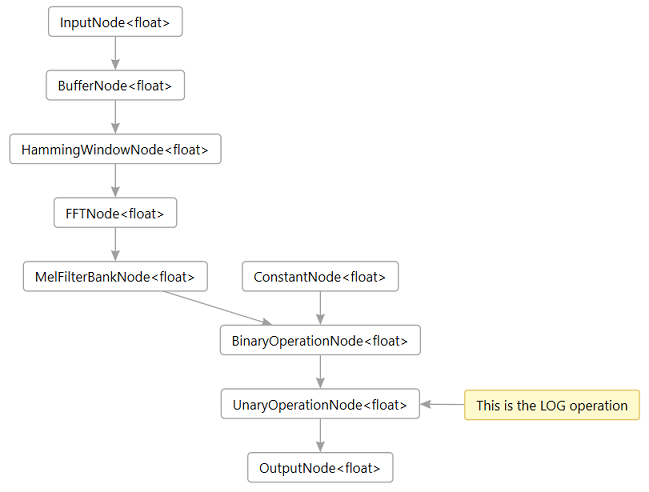
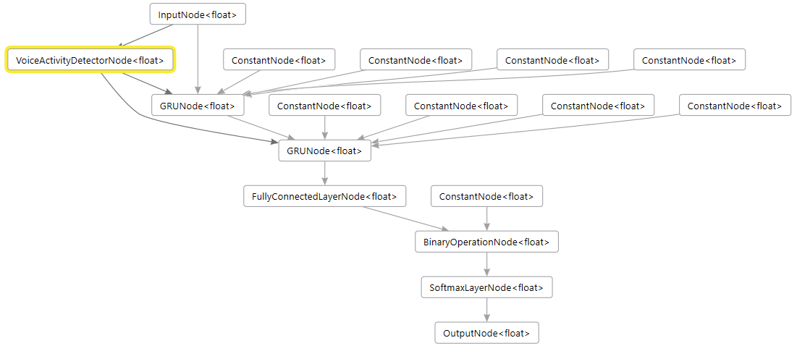

# Training an audio keyword spotter with PyTorch

*by Chris Lovett*

This tutorial will show you how to train a keyword spotter using PyTorch.  A keyword spotter listens to an audio stream from a microphone and recognizes certain spoken keywords.
Since it is always listening there is good reason to find a keyword spotter that can run on a very small low-power co-processor so the main computer can sleep until
a word is recognized.  The ELL compiler makes that possible.  In this tutorial you will train a keyword spotter using the the [speech commands dataset](http://download.tensorflow.org/data/speech_commands_v0.01.tar.gz) which contains 65,000 recordings of 30 different keywords (_bed, bird, cat, dog, down, eight, five, four, go, happy, house, left, marvin, nine, no, off, on, one, right, seven, sheila, six, stop, three, tree, two, up, wow, yes, zero_) each about one second long.  

This is the dataset used to train the models in the [speech commands model gallery](/ELL/gallery/speech_commands_v0.01/).  The [Getting started with keyword spotting on the Raspberry Pi](/ELL/tutorials/Getting-started-with-keyword-spotting-on-the-Raspberry-Pi/) tutorial uses these models.
Once you learn how to train a model you can then train your own custom model that responds to different keywords, or even random sounds, or perhaps you want just a subset of the 30 keywords for your application.  This tutorial shows you how to do that.

## Before you begin

Complete the following steps before starting the tutorial.
* Install ELL on your computer ([Windows](https://github.com/Microsoft/ELL/blob/master/INSTALL-Windows.md), [Ubuntu Linux](https://github.com/Microsoft/ELL/blob/master/INSTALL-Ubuntu.md), [macOS](https://github.com/Microsoft/ELL/blob/master/INSTALL-Mac.md)).

## What you will need

*  Laptop or desktop computer 
*  Optional NVidia Graphics Card that supports [CUDA](https://developer.nvidia.com/cuda-downloads).

## Overview

The picture below illustrates the process you will follow in this tutorial.  First you will convert the wav files into a big training dataset using a featurizer.  This dataset is the input to the training process which outputs a trained keyword spotter.  The keyword spotter can then be verified by testing.


Training a Neural Network is a computationally intensive task that takes millions or even billions of floating point operations.  That is why you probably want to use CUDA accelerated training.  Fortunately, audio models train pretty quickly.  On an NVidia 1080 graphic card the 30 keyword speech_commands dataset trains in about 3 minutes using PyTorch.  Without CUDA the same training takes over 2.5 hours on an Intel Core i7 CPU.  

## ELL Root

After you have installed and built the ELL compiler, you also need to set an environment variable named ELL_ROOT that points to the location of your ELL git repo, for example:

```
[Linux] export ELL_ROOT="~/git/ell"

[Windows] set ELL_ROOT=d:\git\ell
```

Subsequent scripts depend on this path being set correctly.  Now make a new working folder and copy the scripts from this location:

```shell
mkdir tutorial
cd tutorial

[Linux] cp $ELL_ROOT/tools/utilities/pythonlibs/audio/training
[Windows] copy %ELL_ROOT%\tools\utilities\pythonlibs\audio\training
```

## Installing PyTorch

Installing PyTorch with CUDA is easy to do using your Conda environment.  If you don't have a Conda environment, see the ELL setup instructions ([Windows](https://github.com/Microsoft/ELL/blob/master/INSTALL-Windows.md), [Ubuntu Linux](https://github.com/Microsoft/ELL/blob/master/INSTALL-Ubuntu.md), [macOS](https://github.com/Microsoft/ELL/blob/master/INSTALL-Mac.md)).

You may want to create a new Conda environment for PyTorch training, or you can add PyTorch to your existing one.  You can create a new environment easily with this command:

```shell
conda create -n torch python=3.6
```

Activate it

```shell
[Linux] source activate torch
[Windows] activate torch
```

Then do the following:

```shell
[Linux, macOS] conda install pytorch cuda90 torchvision -c pytorch
[Linux, macOS] pip install pyaudio

[Windows] conda install pytorch cuda90 -c pytorch
[Windows] pip install torchvision
[Windows] conda install -c defaults intel-openmp -f
[Windows] pip install pyaudio
```

## Downloading the Training Data

Next, you will need to download the training data set:

* [Speech Commands Dataset](http://download.tensorflow.org/data/speech_commands_v0.01.tar.gz) (1.4 gigabytes)

Google crowd sourced the creation of these recordings so you get a nice variety of voices.  Google released it under the [Creative Commons BY 4.0 license](https://creativecommons.org/licenses/by/4.0/).

Go ahead and download that file and move it into a folder named `audio` then unpack it using this Linux command:

```shell
tar xvf speech_commands_v0.01.tar.gz
```

On Windows you can use the [Windows Subsystem for Linux](https://docs.microsoft.com/en-us/windows/wsl/install-win10) to do the same.  Alternatively, you can install [7-zip](https://www.7-zip.org/download.html).  7-zip will install a new menu item so you can right click the `speech_commands_v0.01.tar.gz` and select "Extract here".
The total disk space required for the uncompressed files is about 2 GB.  When complete your `audio` folder should contain 30 folders plus one named _background\_noise_. You should also see the following additional files:

* validation_list.txt - the list of files that make up the validation set
* testing_list.txt - the list of files in the testing set

Lastly, you will need to create the **training_list.txt** file containing all the wav files (minus the validation and test sets) which you can do with this command:

```shell
python make_training_list.py --wav_files audio --max_files_per_directory 1600
copy audio\categories.txt .
```

Where `audio` is the path to your unpacked speech command wav files.  This will also create a **categories.txt** file in the same folder. This file lists the
names of the keywords (directories) found in the audio folder.  Copy that file to your working tutorial folder.

Note that the command line above includes the option `--max_files_per_directory 1600`.  This options limits the training list to a maximum of 1600 files per subdirectory and will result in a training dataset of around 1.2 GB (using the make_dataset command line options shown below).  Feel free to try other numbers here or remove the limit entirely to use every available file for training.  You will notice there are not exactly the same number of training files in each subdirectory, but that is ok.  Without any limits the full speech_commands training dataset file will be about 1.6 GB and the **make_training_list.py** script may use up to 6 gb RAM to get the job done.

As you can see you can try different sized training datasets.  When you are ready to experiment, figure out which gives the best results, all the training files, or a subset.

## Create a Featurizer Model

As shown in the [earlier tutorial](/ELL/tutorials/Getting-started-with-audio-keyword-classification-on-the-Raspberry-Pi/) the featurizer model is a [mel-frequency cepstrum](https://en.wikipedia.org/wiki/Mel-frequency_cepstrum) (mfcc) audio transformer which preprocesses audio input, preparing it for use by the training process.

This featurizer is created as an ELL model using the `make_featurizer` command:

```
python make_featurizer.py --sample_rate 8000 --window_size 256 --input_buffer_size 256 --filterbank_size 40 --log
```

You should see a message saying "Saving **featurizer.ell**" and if you print this using the following command line:

```shell
[Linux] %ELL_Root%/build/bin/print -imap featurizer.ell 
[Windows] %ELL_Root%\build\bin\release\print -imap featurizer.ell -fmt dgml -of graph.dgml
```

then you will see the following nodes:



You can now compile this model using the ELL model compiler to run on your PC using the familiar `wrap` command:

```
[Windows] python %ELL_ROOT%\tools\wrap\wrap.py --model_file featurizer.ell --outdir compiled_featurizer --module_name mfcc

[Linux] python $ELL_ROOT/tools/wrap/wrap.py --model_file featurizer.ell --outdir compiled_featurizer --module_name mfcc
```

Then you can build the **compiled_featurizer** folder using cmake as done in prior tutorials.
You will do this a lot so it might be handy to create a little batch or shell script called `makeit` that contains the following:

**Windows**:

```batch
mkdir build
cd build
cmake -G "Visual Studio 15 2017 Win64" ..
cmake --build . --config Release
cd ..
```

**Linux**: 

```shell
#!/bin/bash
mkdir build
cd build
cmake ..
make
cd ..
```

So compiling a wrapped ELL model is now this simple:

```shell
pushd compiled_featurizer
makeit
popd
```

## Create the Dataset using the Featurizer

Now you have a compiled featurizer, so you can preprocess all the audio files using this featurizer and create a compressed numpy dataset with the result.  This large dataset will contain one row per audio file, where each row contains all the featurizer output for that file.  The featurizer output is smaller than the raw audio, but it will still end up being a pretty big file, (about 1.2 GB).  Of course it depends how many files you include in the set.  Remember for best training results the more files the better, so  you will use the **training_list.txt** you created earlier which selected 1600 files per keyword.  You need three datasets created from each of the list files in your audio folder using `make_dataset` as follows:

```shell
python make_dataset.py --list_file audio/training_list.txt --featurizer compiled_featurizer/mfcc --sample_rate 8000 
python make_dataset.py --list_file audio/validation_list.txt --featurizer compiled_featurizer/mfcc --sample_rate 8000 
python make_dataset.py --list_file audio/testing_list.txt --featurizer compiled_featurizer/mfcc --sample_rate 8000 
```

Where the **audio** folder contains your unpacked .wav files.  If your audio files are in a different location then simply provide the full path to it in the above commands.  

The reason for the `--sample_rate 8000` argument is that small low powered target devices might not be able to record and process audio at very high rates.
So while your host PC can probably do 96kHz audio and higher just fine, this tutorial shows you how to down sample the audio to something that will run on a tiny target device.  The main point being that you will get the best results if you train the model on audio that is sampled at the same rate that your target device will be recording.

Creating the datasets will take a while, about 10 minutes or more, so now is a great time to grab a cup of tea.  It will produce three files in your working folder named **training.npz**, **validation.npz** and **testing.npz** which you will use below.

You will notice in the output that the _background\_noise_ folder has been mapped to the special category named `<null>`.  Any folder starting with an underscore is mapped this way and it is a handy way to provide "negative samples" that you want your model to learn to ignore.  Negative examples are important if you want a model that doesn't produce too many false positives.

## Train the Keyword Spotter

You can now finally train the keyword spotter using the `train_classifier` script:

```shell
python train_classifier.py --architecture GRU --audio .
```

This script will use PyTorch to train a GRU based model using the datasets you created earlier then it will export an onnx model from that.  The file will be named **KeywordSpotter.onnx** and if all goes well you should see console output like this:

```
Loading d:\datasets\Audio\Kaggle\train\audio\training_list.npz...
Loading d:\datasets\Audio\Kaggle\train\audio\validation_list.npz...
Training keyword spotter using 46953 rows of featurized training input...
Epoch 0, Loss 1.5005683898925781, Validation Accuracy 65.404
Epoch 1, Loss 1.191438913345337, Validation Accuracy 76.931
Epoch 2, Loss 1.031152606010437, Validation Accuracy 81.928
Epoch 3, Loss 0.8680925369262695, Validation Accuracy 84.891
Epoch 4, Loss 0.8902071118354797, Validation Accuracy 85.996
Epoch 5, Loss 0.7643579244613647, Validation Accuracy 87.294
Epoch 6, Loss 0.7202472686767578, Validation Accuracy 87.058
Epoch 7, Loss 0.7902640104293823, Validation Accuracy 87.618
Epoch 8, Loss 0.7076990008354187, Validation Accuracy 88.163
Epoch 9, Loss 0.7693088054656982, Validation Accuracy 87.765
Epoch 10, Loss 0.6854181289672852, Validation Accuracy 88.561
Epoch 11, Loss 0.805185854434967, Validation Accuracy 88.414
Epoch 12, Loss 0.5628467202186584, Validation Accuracy 89.121
Epoch 13, Loss 0.7616006135940552, Validation Accuracy 89.239
Epoch 14, Loss 0.6700156331062317, Validation Accuracy 89.107
Epoch 15, Loss 0.5844067931175232, Validation Accuracy 89.180
Epoch 16, Loss 0.583706259727478, Validation Accuracy 89.166
Epoch 17, Loss 0.6179401278495789, Validation Accuracy 89.225
Epoch 18, Loss 0.6164156794548035, Validation Accuracy 88.856
Epoch 19, Loss 0.5983876585960388, Validation Accuracy 89.225
Epoch 20, Loss 0.6414792537689209, Validation Accuracy 89.328
Epoch 21, Loss 0.600459635257721, Validation Accuracy 89.269
Epoch 22, Loss 0.5980986952781677, Validation Accuracy 89.460
Epoch 23, Loss 0.5426868200302124, Validation Accuracy 89.372
Epoch 24, Loss 0.552982747554779, Validation Accuracy 89.682
Epoch 25, Loss 0.5772491097450256, Validation Accuracy 89.446
Epoch 26, Loss 0.5909024477005005, Validation Accuracy 89.298
Epoch 27, Loss 0.5863549709320068, Validation Accuracy 89.814
Epoch 28, Loss 0.605217456817627, Validation Accuracy 89.505
Epoch 29, Loss 0.5369739532470703, Validation Accuracy 89.785
Trained in 380.31 seconds, saved model 'KeywordSpotter.pt'
Training accuracy = 98.849 %
Loading d:\datasets\Audio\Kaggle\train\audio\testing_list.npz...
Testing accuracy = 89.696 %
saving onnx file: KeywordSpotter.onnx
```

So here you see the model has trained pretty well and is getting an evaluation score of 89.696% using the **testing_list.npz** dataset.  The testing_list contains files that the training_list never saw before so it is expected that the test score (89.7%) will always be lower than the final training accuracy (98.8%).  The real trick is increasing that test score.  This problem has many data scientists employed around the world!

## Importing the ONNX Model

In order to try your new model using ELL, you first need to import it from ONNX into the ELL format as follows:

```
[Linux] python $ELL_ROOT/tools/importers/onnx/onnx_import.py GRUKeywordSpotter.onnx
[Windows] python %ELL_ROOT%\tools\importers\onnx\onnx_import.py GRUKeywordSpotter.onnx
```

This will generate an ELL model named **GRUKeywordSpotter.ell** which you can now compile using similar technique you used on the featurizer:

```
[Linux] python $ELL_ROOT%/tools/wrap/wrap.py --model_file GRUKeywordSpotter.ell --outdir KeywordSpotter --module_name model
[Windows] python %ELL_ROOT%\tools\wrap\wrap.py --model_file GRUKeywordSpotter.ell --outdir KeywordSpotter --module_name model
```

then compile the resulting KeywordSpotter project using your new `makeit` command:

```shell
pushd KeywordSpotter
makeit
popd
```

## Testing the Model

So you can now take the new compiled keyword spotter for a spin and see how it works.  You can measure the accuracy of the ELL model using the testing list.  The `eval_test.py` script will do that:

```shell
python eval_test.py --classifier KeywordSpotter/model --featurizer compiled_featurizer/mfcc --sample_rate 8000 --list_file audio/testing_list.txt --categories categories.txt --reset
```

This is going back to the raw .wav file input and refeaturizing each .wav file using the compiled featurizer.  This is similar to what you will do on your target device while processing microphone input.  As a result this test pass will take a little longer (about 2 minutes).  You will see every file scroll by telling you which one passed or failed with 
a running pass rate.  The last page of output should look something like this:

```
...
PASSED 88.37%: zero
FAILED: go, expecting zero, path=zero/d0faf7e4_nohash_4.wav
FAILED: go, expecting zero, path=zero/d0faf7e4_nohash_5.wav
PASSED 88.35%: zero
PASSED 88.35%: zero
PASSED 88.38%: zero
PASSED 88.38%: zero
PASSED 88.39%: zero
PASSED 88.39%: zero
PASSED 88.40%: zero
PASSED 88.40%: zero
PASSED 88.41%: zero
PASSED 88.41%: zero
Test completed in 135.90 seconds
6043 passed, 792 failed, pass rate of 88.41 %
Best prediction time was 0.0 seconds
```

The final pass rate printed here is 88.49% which is close to the pytorch test accuracy of 89.69%.

But how will this model perform on a continuous stream of audio from a microphone?  You can try this out using the following tool:

```
[Linux] python $ELL_ROOT/tools/utilities/pythonlibs/audio/view_audio.py --classifier KeywordSpotter\model --featurizer compiled_featurizer/mfcc --categories categories.txt --sample_rate 8000 --threshold 0.8

[Windows] python %ELL_ROOT%\tools\utilities\pythonlibs\audio\view_audio.py --classifier KeywordSpotter\model --featurizer compiled_featurizer/mfcc --categories categories.txt --sample_rate 8000 --threshold 0.8
```

Speak some words from `categories.txt` slowly and clearly.  You will find that the accuracy is not as good, it recoginizes the first word you speak, but nothing else.
If you run the `eval_test.py` script without "--reset" argument then the test is run as one continuous steam of audio with no model reset between each .wav file.
In this case you will see the test score drop to about 70%.  So why is this?
Well, remember the trainer has one row per wav recording and this helps the trainer know when to reset the GRU node hidden state.
See the **init_hidden** method.
But in live audio how do you know when one word stops and another starts? Sometimes spoken words blur together.
How does ELL then know when to reset the GRU nodes hidden state?
By default ELL does not reset the hidden state so the GRU state blurs together over time and gets confused especially if there is no clear silence between consecutive words.

So how can you fix this?  Well, this is where Voice Activity Detection (VAD) can come in handy.  ELL actually has a node called VoiceActivityDetectorNode that you can add to the model.  The input is the same featurizer input that the classifier uses, and the output is an integer value 0 if there is no activity detected and 1 if there is activity.  This output signal can then be piped into the GRU nodes as a "reset_trigger".  The GRU nodes will then reset themselves when they see that trigger change from 1 to 0 (the end of a word).  To enable this you will need to edit the ELL **GRUKeywordSpotter.ell** file using the `add_vad.py` script:

```
python add_vad.py GRUKeywordSpotter.ell --sample_rate 8000 --window_size 256 --tau_up 1.5 --tau_down 0.09 --large_input 4 --gain_att 0.01 --threshold_up 3.5 --threshold_down 0.9 --level_threshold 0.02
```

This will edit the ELL model, remove the dummy reset triggers on the two GRU nodes and replace them with a VoiceActivityDetectorNode.  Your new GRUKeywordSpotter.ell should now look like this:



**Note:** you can use the following tool to generate these graphs:

```
[Linux] %ELL_ROOT%\build\bin\release\print -imap GRUKeywordSpotter.ell -fmt dot -of graph.dot
[Windows] %ELL_ROOT%\build\bin\release\print -imap GRUKeywordSpotter.ell -fmt dgml -of graph.dgml
```

And you can view graph.dgml using Visual Studio.  On Linux you can use the `dot` format which can be viewed using GraphViz.

You can now compile this new GRUKeywordSpotter.ell model using `wrap.py` as before and try it out.  You should see the `eval_test` accuracy increase back up from 70% to about 85%.  The VoiceActivityDetector is not perfect on all the audio test samples, especially those with high background noise.  The VoiceActivityDetector has many parameters that you can see in `add_vad.py`.  These parameters can be tuned for your particular device to get the best result.  You can use the `<ELL_ROOT>/tools/utilities/pythonlibs/audio/vad_test.py` tool to help with that.

You can also use the `view_audio.py` script again and see how it behaves when you speak the 30 different keywords listed in categories.txt.  You should notice that it works better now because of the VoiceActivityDetection whereas previously you had to click "stop" and "record" to reset the model. Now it resets automatically and is able to recognize the next keyword after a small silence.  You still cannot speak the keywords too quickly, so this solution is not perfect.  Understanding full conversation speech is a different kind of problem that requires bigger models and audio datasets that include whole phrases.

## Experimenting

The `train_classifier.py` script has a number of other options you can play with including number of epochs, batch_size, learning_rate, and the number of hidden_units to use in the GRU layers.  Note that training also has an element of randomness to it, so you will never see the exact same numbers even when you retrain with the exact same parameters.  This is due to the Stochastic Gradient Descent algorithm that is used by the trainer.

The neural network you just trained is described by the KeywordSpotter class in the `train_classifier.py` script.  You can see the **\_\_init\_\_** method of the GRUKeywordSpotter class creating two GRU nodes and a Linear layer which are used by the **forward** method as follows:

```python
    def forward(self, input):
        # input has shape: [seq,batch,feature]
        gru_out, self.hidden1 = self.gru1(input, self.hidden1)
        gru_out, self.hidden2 = self.gru2(gru_out, self.hidden2)
        keyword_space = self.hidden2keyword(gru_out) 
        result = F.log_softmax(keyword_space, dim=2)
        # return the mean across the sequence length to produce the 
        # best prediction of which word it found in that sequence.
        # we can do that because we know each window_size sequence in  
        # the training dataset contains at most one word and a single
        # word is not spread across multiple training rows
        result = result.mean(dim=0) 
        return result
```

You can now experiment with different model architectures.  For example, what happens if you add a third GRU layer?  To do that you can make the following changes to the KeywordSpotter class:

1. Add the construction of the 3rd GRU layer in the **\_\_init\_\_** method:

    ```python
    self.gru3 = nn.GRU(hidden_dim, num_keywords)    
    ```

2. Change the Linear layer to take a different number of inputs since the output of gru3 will now be size **num_keywords** instead of **hidden_dim**:

    ```python
    self.hidden2keyword = nn.Linear(num_keywords, num_keywords)
    ```    

3. Add a third hidden state member in the **init_hidden** method: 

    ```python
    self.hidden3 = None
    ```

4. Use this new GRU layer in the **forward** method right after the gru2.

    ```python
    gru_out, self.hidden3 = self.gru3(gru_out, self.hidden3)
    ```

5. That's it! Pretty simple.  Now re-run `train_classifier` as before.  Your new model should get an evaluation accuracy that is similar, so the 3rd GRU layer didn't really help much.  But accuracy is not the only measure, you might also want to compare the performance of these two models to see which one is faster.  It is often a speed versus accuracy trade off with neural networks which is why you see a speed versus accuracy graph on the [ELL Model Gallery](https://microsoft.github.io/ELL/gallery/).

There are many other things you could try.  So long as the trainer still shows a decreasing loss across epochs then it should train ok.  You know you have a broken model if the loss never decreases.

As you can see, PyTorch makes it pretty easy to experiment.
To learn more about PyTorch see their [excelent tutorials](https://pytorch.org/tutorials/).

## Next steps

That's it, you just trained your first keyword spotter using PyTorch and you compiled and tested it using ELL, congratulations!  You can now use your new featurizer and classifier in your embedded application, perhaps on a Raspberry Pi, or even on an [Azure IOT Dev Kit](https://microsoft.github.io/azure-iot-developer-kit/).

There are also lots of things you can experiment with as listed above.  You can also build your own training sets, or customize the speech commands set by simply modifying the the **training_list.txt** file, then recreate the **training_list.npz** dataset using `make_dataset.py`, retrain the model and see how it does.  

Another dimension you can play with is mixing noise with your clean .wav files.  This can give you a much bigger dataset and a model that performs better in noisy locations.  Of course, this depends on what kind of noise you care about.  Crowds of people? Industrial machinery? Just the hum of computers and HVAC systems in an Office environment?  It depends on your application.  You can experiment using the noise files included in the speech_commands dataset.

The <a href="https://github.com/Microsoft/ELL-models/tree/master/models/speech_commands_v0.01">github speech commands gallery</a> contains some other types of models, some based on LSTM nodes, for example.  The GRU architecture does well on smaller sized models, but LSTM hits the highest score
when it maximizes the hidden state size.  You can also see on the gallery that the 8kHz audio is faster, but it loses accuracy.

## Troubleshooting

For any PyTorch issues, see [https://pytorch.org/](https://pytorch.org/).

`Exception: Please set your ELL_ROOT environment, as you will be using python scripts from there`
If you see this error then you need to following ELL setup instructions above and clone the ELL repo, build it, and set an environment variable that points to the location of that repo.  This tutorial uses scripts in that repo, and those scripts use the binaries that are built there.
