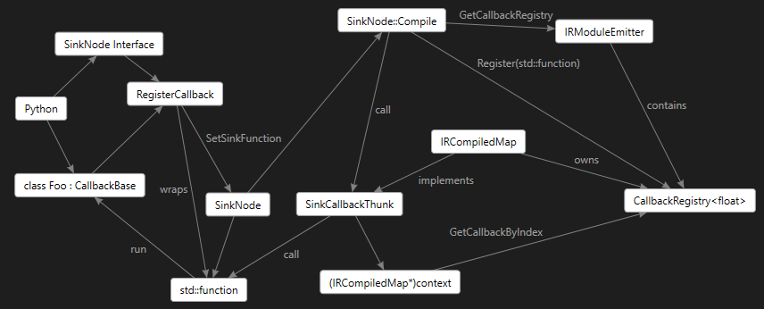

## Callbacks

The ELL model supports two special nodes called SourceNode and SinkNode
that provide a callback mechanism during "predict" that allows an outside
party to provide data (SourceNode) to any point in the graph and receive data (SinkNode) from any point in the graph.

The callbacks are given names and the "C" interface generated for them is `modulename_callbackname(void* context, float* buffer, int size)`.  The buffer is typed according to the port type of the node (float, double, int, etc).  The SourceNode
callback has a boolean return value which indicates whether the
callback actually returned any data or not.  The idea being the SourceNode
might not be ready yet.  The model will leave the buffer unmodified in that case and continue on with 'old' data.

## Scripting

The script then creates a SinkNode or SourceNode in the model and calls RegisterCallback on that node passing the function. For example, to add a Sink callback to spy on the output of any node in the graph, simply do this:

```python
class SinkObject():
    def run(self, data):
        self.data = ell.math.DoubleVector(data)
        return True

sinkNode = model.AddSink(nodeX, dataLayout, "Sink1")
sink = SinkObject()
sinkNode.RegisterCallbackDouble(sink.run)
```

Then after you call Compute on the Map or CompiledMap the sink.data field will be populated with the output data from nodeX.  The helper script
`model_trace.py` in tools\utilities\modelTrace does exactly this for every
node in the graph so you can compare the output of a model before and after
it is compiled.

Similarly, you can provide a SourceNode which injects data into the graph at any point as follows:

```python
def fill_with_ones():
    ones = ell.math.DoubleVector([1] * data.size())
    data.copy_from(ones)
    return True

source = model.AddSource(timeInput, ell.nodes.PortType.real, ell.model.PortMemoryLayout([int(10)]), "Source1")
source.RegisterCallbackDouble(fill_with_ones)
```

Now the output of this node can be passed along to the next node in the graph.  The `timeInput` on a SourceNode is an optional timestamp that can
be associated with a ClockNode to gate the frequency of calls.

## Implementation

The "CallbackBase" interface is provided so that callbacks can marshalled back into the scripting language like Python.  This interface provides a virtual method called "Run" which a scripting language can implement.  This "Run" method is called during "predict" to handle the callback.
This interface is templatized on the element type (double, float, etc) and the data is passes as a FloatVector, DoubleVector, etc.

To make this work for both Map and CompiledMap we need some additional
machinery.  The Map::Compute case is relatively easy, the Compute code path in SinkNode and SourceNode simply calls the std::function that is defined, that in turn delegates to the CallbackBase::Run method and all is good.

The CompiledMap case is a bit more involved.  Normally the Compiled code
emits a "C" interface for callbacks which contains only a "context" parameter, the raw typed buffer and an integer buffer size.  This is not enough information to find our custom CallbackBase object.

So the SourceNode and SinkNode now do something different if a std::function
is defined.  In this case they go back to the owning IRCompiledMap and ask for
a CallbackRegistry object, and they register the std::function there, this
returns an integer index for the std::function.  This index is then added to a new internal only "C" interface that looks like this:

```cpp
bool SourceCallbackThunk_double(int index, void* context, double* buffer, int size)
{
    return ForwardSourceCallback<double>(index, context, buffer, size);
}
```

Where the templatized ForwardSourceCallback uses that index and the fact that the
context pointer is the IRCompiledMap to get the std::function back from the
CallbackRegistry. It then converts the
raw "C" buffer to a std::vector which the scripting interface needs to call the CallbackBase::Run method.

```cpp
template <typename ElementType>
bool ForwardSourceCallback(int index, void* context, ElementType* buffer, int size)
{
    bool result = true;
    IRCompiledMap* map = reinterpret_cast<IRCompiledMap*>(context);
    if (map)
    {
        auto func = map->GetCallbackRegistry<ElementType>().GetSourceCallback(index);
        if (func)
        {
            std::vector<ElementType> data(buffer, buffer + size);
            result = func(data);
            ::memcpy(buffer, data.data(), sizeof(ElementType) * size);
        }
    }
    return result;
}
```

Phew! So this is the picture of what is going on now:

