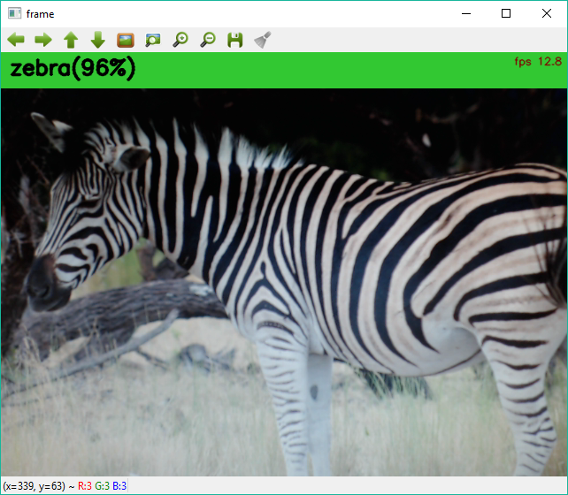

## Reference Test

This tutorial shows how to test an ELL model without having to "compile" it.
ELL includes a model "interpreter", if you like, that provides a way to "evaluate" a model.
This is not the highest performance way of running a model, but it is the most
convenient, and is a great choice for folks who are experimenting with their models.
We have also found it an excellent way to test that the compiled model is doing the right thing.
So consider this a model debug/test tool.

### Darknet Import 

To use it first you need to import your model into ELL model format using `darknet_import.py`
from the `~/tools/importers/darknet` folder. 

First we download the Darknet ImageNet reference model as follows:

    curl -O https://raw.githubusercontent.com/pjreddie/darknet/master/cfg/darknet.cfg
    curl -O https://pjreddie.com/media/files/darknet.weights

You can also copy the `darknetImageNetLabels.txt` file from the gettingStarted folder.
Now you can convert the darknet model to ELL format by running the following:

````
python darknet_import.py darknet.cfg darknet.weights 
````

You should see the following output which shows the layers it has loaded
and the configuration information containing size of input and outputs.

````
convolutional:  224 x 224 x 3 ->  224 x 224 x 16 , pad  1
max_pool:  224 x 224 x 16 ->  112 x 112 x 16 , pad  0
convolutional:  112 x 112 x 16 ->  112 x 112 x 32 , pad  1
max_pool:  112 x 112 x 32 ->  56 x 56 x 32 , pad  0
convolutional:  56 x 56 x 32 ->  56 x 56 x 64 , pad  1
max_pool:  56 x 56 x 64 ->  28 x 28 x 64 , pad  0
convolutional:  28 x 28 x 64 ->  28 x 28 x 128 , pad  1
max_pool:  28 x 28 x 128 ->  14 x 14 x 128 , pad  0
convolutional:  14 x 14 x 128 ->  14 x 14 x 256 , pad  1
max_pool:  14 x 14 x 256 ->  7 x 7 x 256 , pad  0
convolutional:  7 x 7 x 256 ->  7 x 7 x 512 , pad  1
max_pool:  7 x 7 x 512 ->  4 x 4 x 512 , pad  1
convolutional:  4 x 4 x 512 ->  4 x 4 x 1024 , pad  1
convolutional:  4 x 4 x 1024 ->  4 x 4 x 1000 , pad  0
avg_pool:  4 x 4 x 1000 ->  1 x 1 x 1000 , pad  0
softmax:  1 x 1 x 1000 ->  1 x 1 x 1000
Saving model file: 'darknet.ellmodel'
Saving config file: 'darknet_config.json'
{
  "input_height": 224,
  "output_height": 1,
  "output_width": 1,
  "output_channels": 1000,
  "input_channels": 3,
  "input_width": 224
}
`````

### Test the Darknet Model

Great, next you can test that the `darknet.ellmodel` works with the ELL
model "interpreter" by running the following:

````
python demo.py darknet_config.json darknetImageNetLabels.txt --model darknet.ellmodel
````

And with camera pointing at a Zebra you should see something like this:



### CNTK Import 

Similarly you can import CNTK models, like this one:

````
curl -O https://www.cntk.ai/Models/Caffe_Converted/VGG16_ImageNet_Caffe.model
````

With the command line from the `~/tools/importers/CNTK` folder. 

````
python cntk_import.py VGG16_ImageNet_Caffe.model
````

You will get a config output and an ELL model file named `VGG16_ImageNet_Caffe.ellmodel`


### Test the CNTK Model

And similarly you can test that the `VGG16_ImageNet_Caffe.ellmodel` works with the ELL model "interpreter" by running the following:

````
python demo.py VGG16_ImageNet_Caffe_config.json cntkVgg16ImageNetLabels.txt --model VGG16_ImageNet_Caffe.ellmodel
````

(you can copy the `cntkVgg16ImageNetLabels.txt` from the gettingStarted folder).

This will take a while to load, so be patient.  This performance problem is fixed by using compiled models.

See how to use [compiled models](../builder/README.md)

