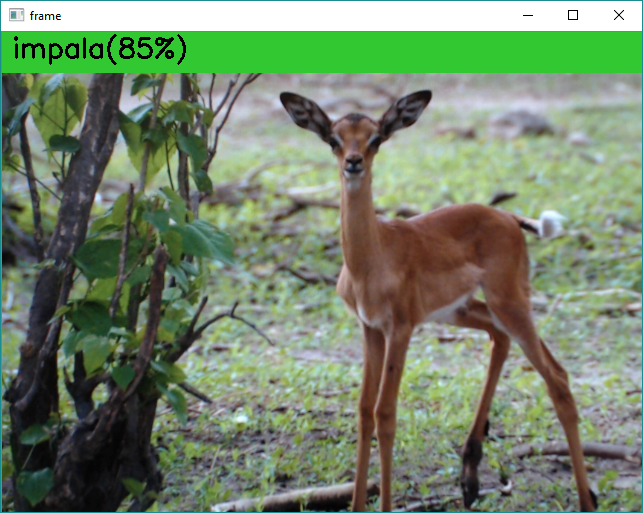

# Darknet

[Joseph Redmon](https://pjreddie.com/darknet/) has published some CNN models on his website.
Joseph calls his project *Darknet*, which sounds spooky, but his models are harmless, and really quite fast. 

We have provided a Python script that can load those Darknet models.
See the *darknet_to_ell* Python module (found in the `tools/importers/darknet` directory)

After building ELL and the ELL Python Language Bindings you will find the following folder in your build output.
So from your conda environment go into that directory:

    cd build/tutorials/vision/gettingStarted

Then download the Darknet ImageNet reference model as follows:

    curl -O https://raw.githubusercontent.com/pjreddie/darknet/master/cfg/darknet.cfg
    curl -O https://pjreddie.com/media/files/darknet.weights

If your conda environment doesn't have curl just run this:

    conda install curl

## Class Labels

You will notice we have already provided the following file which contains a list of class labels that correspond to the model prediction output.

    darknetImageNetLabels.txt

In this file you will see all sorts of fun classes from dog breeds to birds, fire truck, school bus, and many more.  It has 1000 classes it can predict.

## Reference Implementation

Ok, so now you can run the following Python script to load up this model and test it out with the ELL Reference Implementation.
This will run on your PC (not on the Raspberry Pi yet), just to test if everything is working:

    python darknetDemo.py

Note: if you have more than one video camera on your PC and you want to switch to a different one you can change the camera index by
passing a command line argument to the script as follows:

    python darknetDemo.py 1

Note: if you don't have a video camera, you can run the model on an image file by specifying the filename in place of the camera index.

    python darknetDemo.py impala.jpg

You should see some output like this while it is loading the model:

    (py35) D:\temp\ELL\tutorials\vision\gettingStarted>python darknet.py 1
    convolutional:  224 x 224 x 3 ->  224 x 224 x 16 , pad  1
    max_pool:  224 x 224 x 16 ->  112 x 112 x 16 , pad  0
    convolutional:  112 x 112 x 16 ->  112 x 112 x 32 , pad  1
    max_pool:  112 x 112 x 32 ->  56 x 56 x 32 , pad  0
    convolutional:  56 x 56 x 32 ->  56 x 56 x 64 , pad  1
    max_pool:  56 x 56 x 64 ->  28 x 28 x 64 , pad  0
    convolutional:  28 x 28 x 64 ->  28 x 28 x 128 , pad  1
    max_pool:  28 x 28 x 128 ->  14 x 14 x 128 , pad  0
    convolutional:  14 x 14 x 128 ->  14 x 14 x 256 , pad  1
    max_pool:  14 x 14 x 256 ->  7 x 7 x 256 , pad  0
    convolutional:  7 x 7 x 256 ->  7 x 7 x 512 , pad  1
    max_pool:  7 x 7 x 512 ->  4 x 4 x 512 , pad  1
    convolutional:  4 x 4 x 512 ->  4 x 4 x 1024 , pad  1
    convolutional:  4 x 4 x 1024 ->  4 x 4 x 1000 , pad  0
    avg_pool:  4 x 4 x 1000 ->  1 x 1 x 1000 , pad  0
    softmax:  1 x 1 x 1000 ->  1 x 1 x 1000

Wait for a few seconds (depending on your computer performance) then you will see the video with image
classification labels at the top, like this:

## Compilation

Once you've tested that the imported model works, you can now proceed with [compiling the model and running it on different devices](compiling.md).